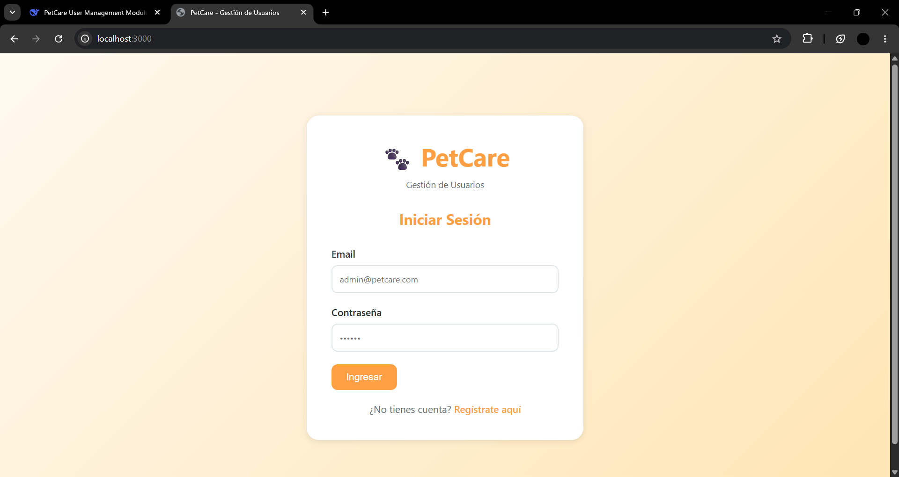
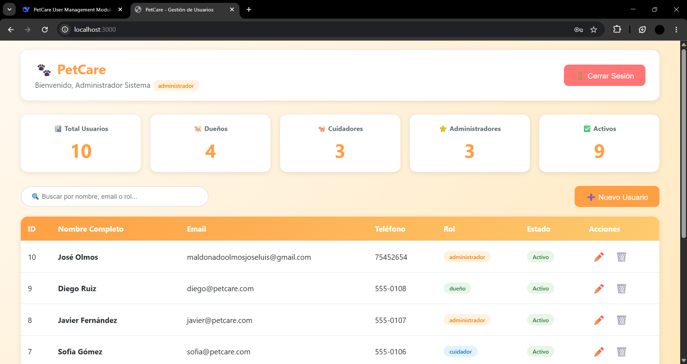

# 🐾 PetCare - Sistema de Gestión de Usuarios

Sistema completo de gestión de usuarios para la plataforma PetCare con autenticación, CRUD completo, búsqueda en tiempo real, estadísticas interactivas y diseño responsivo.

## 📸 Capturas de Pantalla

### Pantalla de Login

### Dashboard Principal

> **Nota:** Agrega más capturas de pantalla (crear usuario, editar, etc.) en la carpeta `docs/images/` para mostrar todas las funcionalidades.

## 🎯 Funcionalidades Implementadas

| ID | Historia de Usuario | Estado |
|----|--------------------|--------|
| US-01 | Iniciar sesión con email y contraseña | ✅ Completado |
| US-02 | Crear nuevos usuarios | ✅ Completado |
| US-03 | Ver lista de todos los usuarios | ✅ Completado |
| US-04 | Editar datos de un usuario | ✅ Completado |
| US-05 | Eliminar un usuario del sistema | ✅ Completado |
| US-06 | Registrarse en la plataforma | ✅ Completado |
| US-07 | Buscar usuarios por nombre, email o rol | ✅ Completado |

### Características Adicionales
- ✅ Dashboard con estadísticas en tiempo real
- ✅ Filtrado por rol (dueño, cuidador, administrador)
- ✅ Filtrado por estado (activo/inactivo)
- ✅ Modales de confirmación para acciones críticas
- ✅ Mensajes de éxito/error con animaciones
- ✅ Diseño completamente responsivo
- ✅ Almacenamiento de sesión en localStorage
- ✅ Validación de formularios en tiempo real

## 🛠️ Tecnologías Utilizadas

| Tecnología | Versión | Propósito |
|------------|---------|-----------|
| **Python** | 3.7+ | Lenguaje backend |
| **Flask** | 2.0+ | Framework web |
| **Flask-CORS** | 6.0+ | Manejo de CORS |
| **SQLite** | 3 | Base de datos |
| **HTML5** | - | Estructura del frontend |
| **CSS3** | - | Estilos y diseño |
| **JavaScript** | ES6 | Lógica e interactividad |

## 📁 Estructura del Proyecto

PrototipoPetCare

│
├── backend/ # Servidor backend
│ ├── app.py # API REST principal (Flask)
│ ├── requirements.txt # Dependencias Python
│ ├── create_database.py # Script para crear BD manualmente
│ └── petcare.db # Base de datos SQLite (autogenerado)
│
├── frontend/ # Cliente frontend
│ ├── index.html # SPA principal
│ ├── css/
│ │ └── style.css # Estilos completos
│ └── js/
│ ├── api.js # Cliente API (fetch)
│ └── app.js # Lógica de la aplicación
│
├── docs/ # Documentación
│ └── images/ # Imágenes para README
│ ├── screenshot1.png.png # Login screen
│ └── screenshot2.png.png # Dashboard
│
├── .gitignore # Archivos ignorados por Git
└── README.md # Documentación del proyecto

# 🚀 Instalación y Ejecución

## Requisitos Previos
- Python 3.7 o superior
- Pip (gestor de paquetes de Python)
- Navegador web moderno (Chrome, Firefox, Edge)

## 1. Configuración del Backend

 Navegar al directorio del backend
cd backend

 Crear entorno virtual
python -m venv venv

 Activar entorno virtual
 En Windows:
venv\Scripts\activate
 En Linux/Mac:
source venv/bin/activate

 Instalar dependencias
pip install -r requirements.txt

 Ejecutar el servidor Flask
python app.py

 Abrir una nueva terminal y navegar al frontend
cd frontend

Iniciar servidor HTTP
python -m http.server 3000

##Credenciales de Acceso

Rol	          Email	          Contraseña
Administrador  	admin@petcare.com	admin123
Dueño          	maria@petcare.com	maria123
Cuidador       	ana@petcare.com	ana123
